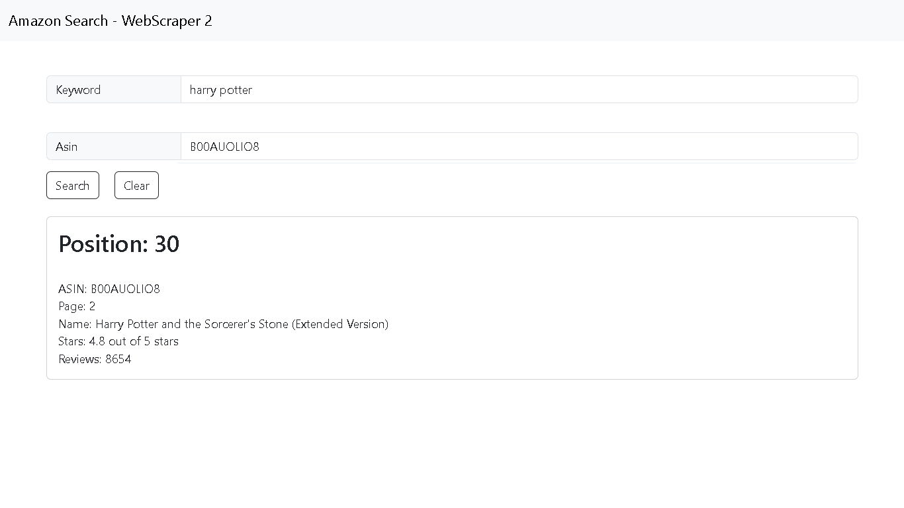

# Simple Web Scraper to amazon.com

# Find the position of a specific ASIN within the results of a keyword search

<h2>The scrapper will return the position and the page of the product ASIN for the search keyword</h2>

Code challenge for the application to a Full Stack Developer Internship
at Carvalho Aleixo Inc. 
This code is an extension from the repository https://github.com/jonatasrossetto/WebScraper

Back-end Stack

- Node.js
- Axios
- Cheerio
- Express, Cors, BodyParser

Front-end Stack

- Html, Css
- Bootstrap
- Javascript

Running Intructions:

- developing environment: npm 10.2.0, node 20.9.0, Chrome Browser
- after downloading the project files run 'npm install' in the command line to install all the projects dependencies
- in the command line run 'node server.js' to run the back-end service, it will start the express server on port 3000
- Open the index.html file with your Browser
- try to search for keyword:"nespresso" and ASIN:"B084H2BPJX" to test the scraper

Images: 
keyword:"nespresso" and ASIN:"B084H2BPJX" 
 
keyword:"harry potter" and ASIN:"B00AUOLIO8" 
 
